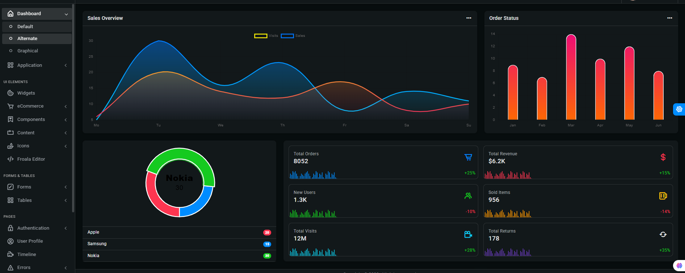
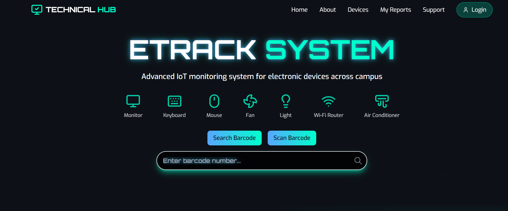
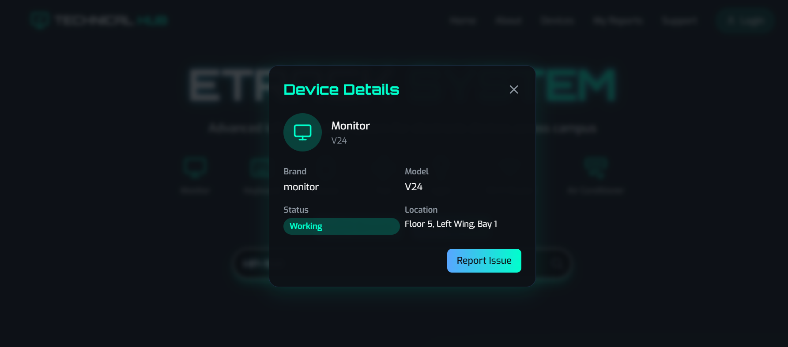

<div align="center">

#  Etrack Management System


**A modern, full-stack solution for property, device, and report management.**

</div>

---

## ✨ Overview

Etrack Management System helps you easily manage properties, floors, rooms, devices, and reports. It provides a simple and secure way for admins and staff to track and update assets in real time.

---

## 🎯 Features

<div align="center">

<table><tr>
<td valign="top" width="50%">
  <table>
    <tr style="background-color:#f0f0f0;">
      <th style="font-size:1.2em; color:#007acc; font-weight:bold; text-align:center;">🚀 Project Features</th>
    </tr>
    <tr><td>User Authentication</td></tr>
    <tr><td>Dashboard</td></tr>
    <tr><td>Property & Inventory Management</td></tr>
    <tr><td>Building Map Visualization</td></tr>
    <tr><td>Reports</td></tr>
    <tr><td>Admin Management</td></tr>
    <tr><td>Real-time Updates</td></tr>
    <tr><td>Responsive UI</td></tr>
    <tr><td>Floor Incharge Interface</td></tr>
  </table>
</td>
<td valign="top" width="50%">
  <table>
    <tr style="background-color:#e0f7fa;">
      <th style="font-size:1.2em; color:#009688; font-weight:bold; text-align:center;">🧑‍🔧 Floor Incharge Features</th>
    </tr>
    <tr><td>Report Device Issues</td></tr>
    <tr><td>Upload Images for Reports</td></tr>
    <tr><td>Track Report Status</td></tr>
    <tr><td>View Assigned Devices</td></tr>
  </table>
</td>
</tr></table>

</div>

---


## 📚 Folder Structure

```text
Etrack_Mgmt_System/
│
├── e-Track/                # Frontend (React)
│   ├── src/
│   │   ├── components/     # UI components (charts, layout, property, UI)
│   │   ├── context/        # React context providers (Auth, Theme, Reports)
│   │   ├── pages/          # Main app pages (Dashboard, Inventory, Login, etc.)
│   │   ├── utils/          # Utility functions and loaders
│   │   └── index.css       # Global styles
│   ├── public/             # Static assets
│   └── ...
│
├── Etrack_Backend/         # Backend (Node.js/Express)
│   ├── controller/         # API controllers
│   ├── modals/             # Mongoose models (schemas)
│   ├── routers/            # Express route handlers
│   ├── public/             # Static files (e.g., images)
│   └── index.js            # Entry point
│
└── README.md               # Project documentation (this file)
```

---

## 🛠️ Tech Stack

<div align="center">

<table>
<tr>
<td align="center" width="200"><b>Frontend</b></td>
<td align="center" width="200"><b>Backend</b></td>
<td align="center" width="200"><b>Other Tools</b></td>
</tr>
<tr>
<td align="center">
   <br>
   <br>
  
</td>
<td align="center">
   <br>
   <br>
  
</td>
<td align="center">
   <br>
   <br>
  
</td>
</tr>
</table>

</div>

---

## 📸 Screenshots

### 📊 Dashboard


### 🧑‍🔧 Incharge UI


### 📝 Report Page


---

## ⚡ Quick Start

> **Frontend (e-Track):**
```sh
cd e-Track
npm install
npm run dev
```
Visit: [http://localhost:5173](http://localhost:5173)

> **Backend (Etrack_Backend):**
```sh
cd Etrack_Backend
npm install
# Add your .env file for sensitive data (MongoDB URI, JWT secret, etc.)
npm start
```
Visit: [http://localhost:3000](http://localhost:3000)

---

## 📚 Usage

- Log in with your credentials
- Navigate via the dashboard: Inventory, Map, Reports, Admin Details, etc.
- Add/manage properties, floors, rooms, and devices
- Generate and view reports for asset tracking and management
- **As a Floor Incharge:**
  - Report device issues directly from your interface
  - Upload images to support your report
  - Track the status of your submitted reports

---

## 🤝 Contribution

> **We welcome contributions!**
>
> 1. Fork the repository
> 2. Create a new branch for your feature or bugfix
> 3. Commit your changes with clear messages
> 4. Open a pull request describing your changes

---

